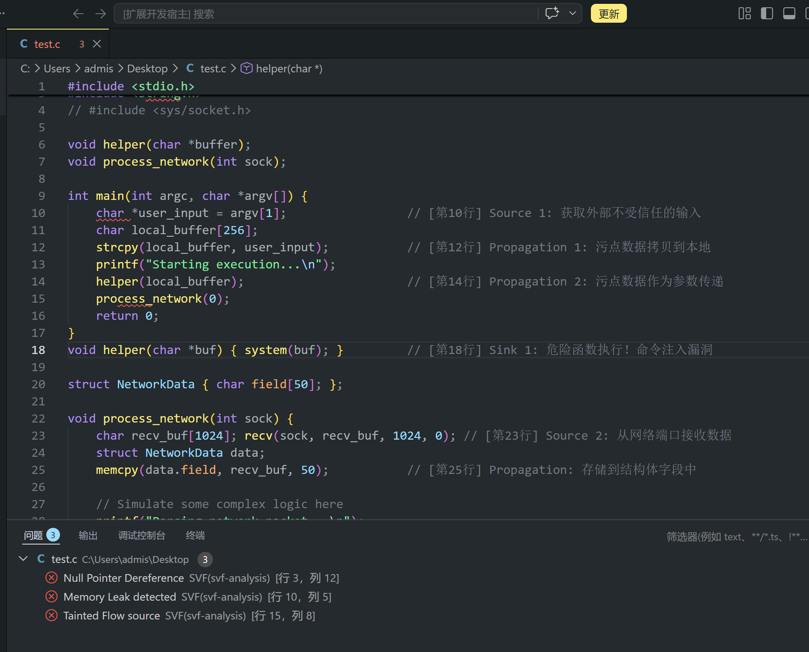
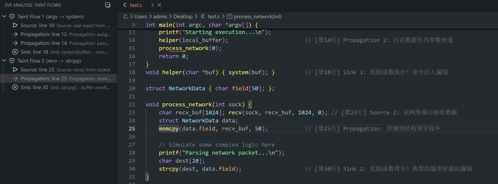

<p align="center">
  
</p>

<h1 align="center">SVF Analysis Linter</h1>

<p align="center">
  A VS Code extension that turns SVF results into inline diagnostics and navigable taint-flow views.
</p>

<p align="center">
  
  
  
  
</p>

<p align="center">
  Built for demoing how SVF findings can feel native inside the editor: visible, clickable, and easy to explain.
</p>

## Overview

SVF Analysis Linter is a lightweight VS Code prototype for presenting static-analysis results in a way that is useful during demos, experiments, and future productization.

Instead of leaving SVF output in a terminal log, the extension brings it into the editor through:

- inline diagnostics with problem markers
- Problems panel integration
- a dedicated taint-flow tree in the Activity Bar
- line-level navigation from source to sink

The current version uses mock analysis output so the UI and interaction model can be validated before wiring in a real SVF CLI pipeline.

## Showcase

### 1. Activity Bar Entry

<p align="center">
  
</p>

<p align="center">
  The compact shield icon marks the extension entry point in the Activity Bar.
</p>

### 2. Diagnostics In Context

<p align="center">
  
</p>

<p align="center">
  Findings are surfaced directly in the editor and mirrored in the Problems panel for quick review.
</p>

### 3. Taint Flow Navigation

<p align="center">
  
</p>

<p align="center">
  The Taint Flows view groups source, propagation, and sink steps into a navigable path.
</p>

## Why This Project

Security analysis tools often produce output that is technically correct but difficult to inspect during a code review or live demo. This project focuses on the last mile:

- show findings exactly where developers are already looking
- make taint propagation understandable at a glance
- let users jump directly from the overview to the vulnerable line

## Feature Highlights

| Area | What it does |
| --- | --- |
| Diagnostics | Converts parsed SVF findings into VS Code diagnostics with precise ranges |
| Problems Panel | Lists issues such as memory leaks, tainted flow sources, and null dereferences |
| Taint Flow View | Groups source, propagation, and sink steps into an explorable tree |
| Navigation | Clicking a tree node jumps to the corresponding line and centers it in the editor |
| Demo Readiness | Ships with a sample C file and mock results for predictable presentation |

## Demo Scenario

The repository includes a sample file, `test.c`, with two representative flows:

1. `argv -> strcpy -> helper -> system`
2. `recv -> memcpy -> strcpy`

These flows make it easy to demonstrate:

- untrusted input entering the program
- propagation across local buffers and struct fields
- dangerous sinks such as `system()` and `strcpy()`

## Commands

The extension currently contributes these commands:

- `SVF: Run Analysis on Current File`
- `SVF: Clear Diagnostics`
- `SVF: Go To Line`

Running the analysis command parses the mock SVF output, publishes diagnostics for the active document, and keeps the taint-flow view ready for navigation.

## Project Layout

```text
.
├─ docs/
│  └─ images/
├─ src/
│  └─ extension.ts
├─ test.c
├─ package.json
└─ tsconfig.json
```

## Local Development

### Install dependencies

```bash
npm install
```

### Build the extension

```bash
npm run compile
```

### Launch the demo

1. Open the project in VS Code.
2. Press `F5` to start an Extension Development Host.
3. Open `test.c` in the new window.
4. Run `SVF: Run Analysis on Current File` from the Command Palette.
5. Inspect the inline diagnostics, the Problems panel, and the `SVF Analysis` view.

## Current Scope

Implemented today:

- diagnostic parsing and rendering
- taint-flow tree rendering
- click-to-line navigation
- demo-friendly sample data

Planned next:

- real SVF CLI execution
- structured parser for real output
- multi-file result aggregation
- cross-file navigation

## Notes For Public Release

This repository is ready for GitHub presentation. Before publishing to the VS Code Marketplace, you will likely still want to add:

- a final publisher identity you own
- a marketplace-ready raster icon
- repository, homepage, and issue tracker URLs
- versioned release notes

## License

MIT